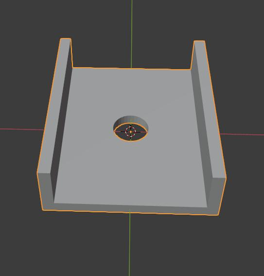
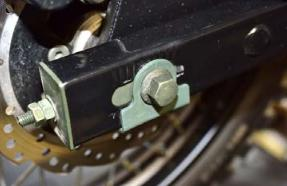

# csc_tt250_openscad_blender
blender files for the csc tt250 motorcycle, custom parts

# Rear axle bracket
This bracket acts as both an adjustment slider for the rear axle 
and improves the original design by having greater thickness.

### original slider 

